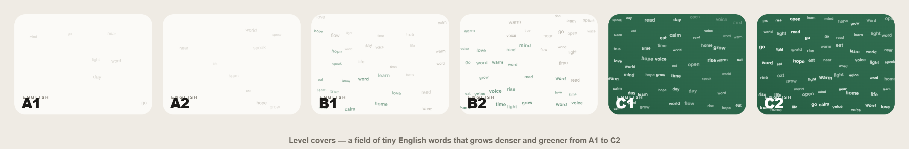
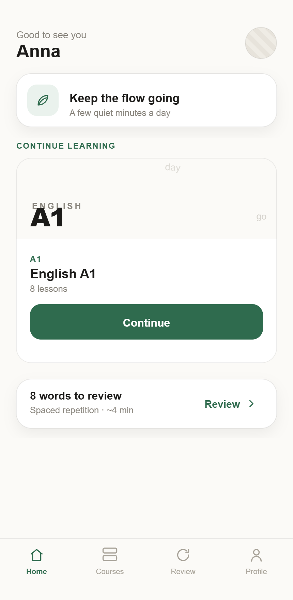
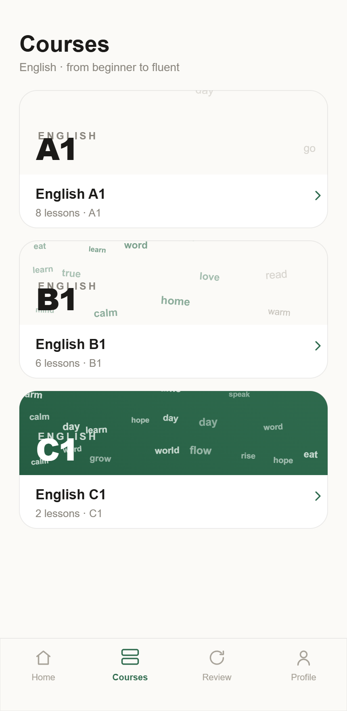
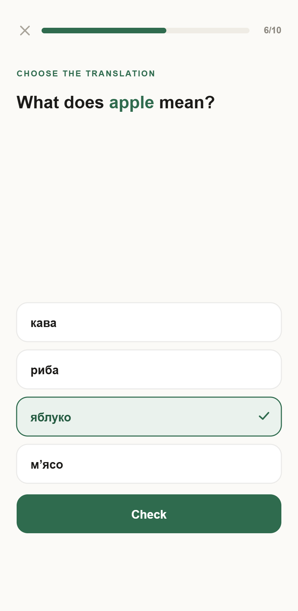
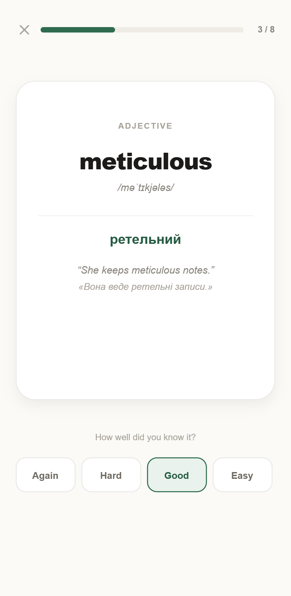
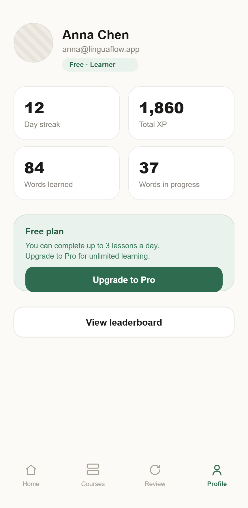
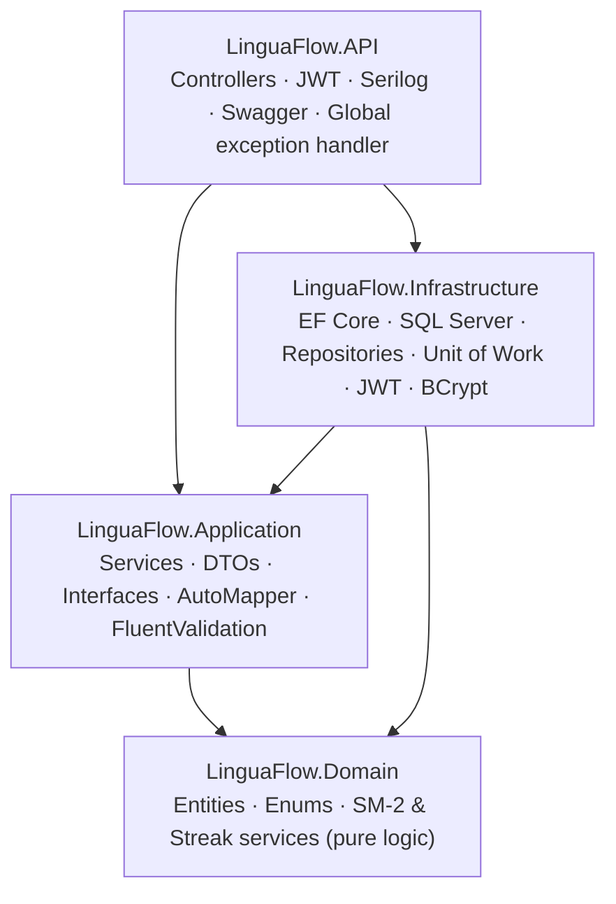

# LinguaFlow

**A premium English-learning app with spaced repetition — built on .NET.**


LinguaFlow is a full-stack language-learning platform: learn English through structured
courses (A1→C2), auto-generated exercises, and a real **SM-2 spaced-repetition** engine,
wrapped in light gamification — XP, streaks, and a leaderboard. The backend is a
**.NET 10 / ASP.NET Core Web API** built on **Clean Architecture** with the learning
algorithms isolated as **unit-tested pure domain services**. The frontend is an installable
**React + TypeScript PWA** with a custom design system.

> Built as a personal project — I was tired of paying monthly for language apps, so I built
> my own and used it to practise production-grade .NET architecture end to end.

---

## Screenshots

<p align="center">
  
</p>
<p align="center"><em>Every level gets a generative cover — a field of tiny English words that grows denser and greener from A1 to C2.</em></p>

<table>
  <tr>
    <td width="33%"><br><sub><b>Home</b> — continue learning, streak, review</sub></td>
    <td width="33%"><br><sub><b>Courses</b> — A1→C2 with generative covers</sub></td>
    <td width="33%"><br><sub><b>Lesson</b> — multiple-choice exercise</sub></td>
  </tr>
  <tr>
    <td width="33%"><br><sub><b>Review</b> — SM-2 flashcard grading</sub></td>
    <td width="33%"><br><sub><b>Leaderboard</b> — ranked by XP</sub></td>
    <td width="33%"><br><sub><b>Profile</b> — stats & freemium plan</sub></td>
  </tr>
</table>

---

## Features

**Learning**
- Courses from **A1 to C2**, each with themed lessons and real vocabulary (English → Ukrainian).
- Exercises generated on the fly per lesson: **flashcards** and **multiple-choice** with shuffled distractors.
- Server-side **answer checking** (the correct answer never leaves the server in the exercise payload).

**Spaced repetition**
- A real **SM-2 algorithm** schedules each word's next review by recall quality (`Again / Hard / Good / Easy`).
- A daily **"due today"** review queue drives long-term retention.

**Gamification**
- **XP** per completed lesson, daily **streaks**, and a global **leaderboard** ranked by XP.

**Accounts & content**
- **JWT authentication** with `User` / `Admin` roles.
- Admin-only content management (courses, lessons, words, exercises).

**Freemium**
- Free users are limited to **3 lessons/day**; the API enforces it and the app surfaces a calm upgrade prompt.

**PWA**
- Installable on mobile, launches standalone, offline-ready app shell.

---

## Tech stack & architecture

### Backend — the core of this project
- **.NET 10**, **ASP.NET Core Web API**
- **Clean / Onion Architecture** — four projects with dependencies pointing **inward** to a dependency-free Domain
- **EF Core 10** + **SQL Server**, code-first migrations, auto-migrate + seed on startup
- **JWT bearer auth** with role-based authorization; passwords hashed with **BCrypt**
- **Repository + Unit of Work** patterns over `DbContext`
- **AutoMapper** (entity ↔ DTO), **FluentValidation** (request validation)
- **Serilog** structured logging (console + file), **global exception handling** → RFC-7807 problem responses
- **Swagger / OpenAPI**, first-class **Dependency Injection** throughout

### Architecture



Dependencies flow **inward**: `Domain` depends on nothing, `Application` depends only on
`Domain`, `Infrastructure` implements `Application` interfaces, and `API` is the composition
root. Business rules stay independent of the database and the web framework.

### Domain logic highlight (the strongest engineering signal)
The two algorithms that matter most are **pure domain services** with **no I/O**, so they're
trivial to reason about and test:

- **`SpacedRepetitionCalculator`** — an **SM-2** implementation: it updates repetitions, the
  ease factor (floored at 1.3), and the interval (`1 → 6 → interval × EF`) from the user's
  grade, then computes the next review date and whether the word is "learned".
- **`StreakCalculator`** — advances a daily streak on consecutive active days and resets it on
  a missed day (with same-day / gap edge cases handled).

Both are covered by **12 unit tests** using **xUnit + Moq + FluentAssertions**:

```bash
dotnet test
```

### Frontend
- **React 18 + TypeScript + Vite**, installable **PWA** (manifest + service worker)
- A small typed API client (`fetch` wrapper with Bearer auth and central 401 handling)
- A custom design system: cream `#FBFAF7` + deep-green `#2F6B4E`, Hanken Grotesk, and the
  generative **`CourseCover`** word-field art (deterministic per level).

---

## Getting started

### Prerequisites
- [.NET 10 SDK](https://dotnet.microsoft.com/)
- [Node.js 18+](https://nodejs.org/)
- SQL Server (LocalDB / Express / full)

### 1. Backend API
The connection string lives in `LinguaFlow.API/appsettings.json`:

```json
"ConnectionStrings": {
  "DefaultConnection": "Server=localhost;Database=LinguaFlow;Trusted_Connection=True;TrustServerCertificate=True;"
}
```

Run it:

```bash
dotnet run --project LinguaFlow.API --launch-profile http
```

On startup the API **applies EF Core migrations automatically** and **seeds an admin user** —
no manual `dotnet ef database update` needed. The API listens on `http://localhost:5215`
(Swagger UI at `/swagger`).

**Seeded admin login:** `admin@linguaflow.local` / `admin123`

### 2. Frontend
```bash
cd linguaflow-web
npm install
npm run dev
```

The app runs on `http://localhost:5173` and reads the API base URL from `VITE_API_URL`
(defaults to `http://localhost:5215`). Register a new account, or sign in as the admin above.

### 3. Tests
```bash
dotnet test
```

---

## Project structure

```
LinguaFlow.sln
├── LinguaFlow.Domain/          # Entities, enums, and pure SM-2 & Streak services (no dependencies)
├── LinguaFlow.Application/     # Use-case services, DTOs, interfaces, AutoMapper, FluentValidation
├── LinguaFlow.Infrastructure/  # EF Core DbContext, repositories, Unit of Work, JWT, BCrypt, seeder
├── LinguaFlow.API/             # ASP.NET Core Web API — controllers, auth, Serilog, Swagger, DI
├── LinguaFlow.Tests/           # xUnit tests for the domain algorithms
└── linguaflow-web/             # React + TypeScript + Vite PWA frontend
```

### Key API endpoints

| Area | Endpoint | Notes |
|---|---|---|
| Auth | `POST /api/auth/register`, `POST /api/auth/login` | Returns a JWT |
| Courses | `GET /api/courses`, `GET /api/courses/{id}` | Admin: create/update/delete |
| Lessons | `GET /api/lessons/{id}/exercises`, `POST /api/lessons/check-answer`, `POST /api/lessons/complete` | Completion awards XP (Free: 3/day) |
| Review | `GET /api/review/today`, `POST /api/review/grade` | SM-2 scheduling |
| Users | `GET /api/users/me`, `GET /api/users/leaderboard` | Profile stats & rankings |

---

## License

Personal portfolio project. © LinguaFlow.
